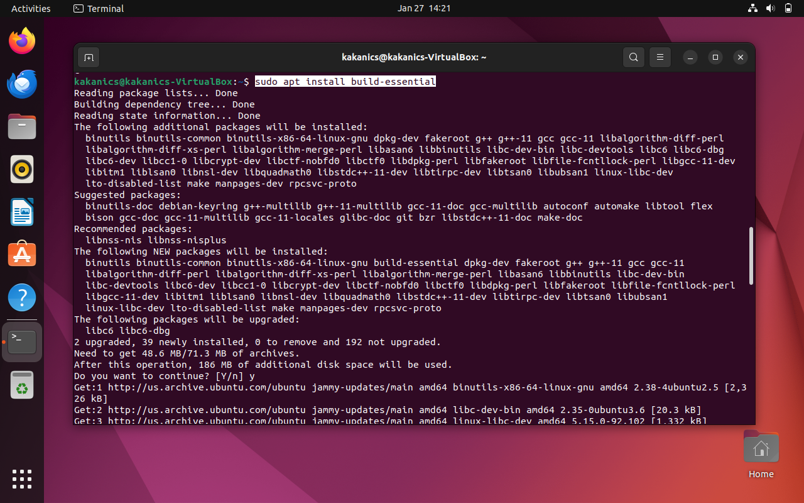

# Ubuntu VM Installation on VirtualBox Guide

## Task 1

### Step 1: Download Ubuntu ISO

- Download the Ubuntu ISO from https://ubuntu.com/download/desktop

### Step 2: Install VirtualBox

- Download and install VirtualBox from https://www.virtualbox.org/wiki/Downloads

### Step 3: Create a New Virtual Machine With Ubuntu

- For creating a virtual machine with Ubuntu OS:

1. Press 'new' in virtual box
2. Give the machine an appropriate name and give the path to ISO file

3. Give a username and select password

4. Give roughly half of your system's resources

5. Give atleast 30GB of virtual hard drive space to the VM

6. Ensure the settings and finish the set up.

The system will boot up and automatically install

Open the terminal and run the given command to test if installation was successful

`sudo apt-get update`

## Task 2

- All commands will be run on terminal.
- Description: Install gcc and g++, and test these compilers.

1. The following command installs gcc, g++ and make

`sudo apt install build-essential`

2. for testing the installation, run

`gcc --version`

3. use the nano command to open notepad and write files. The files I wrote have been provided in the repository as "hello.c" and "hello.cpp"

4. compile the files using

`gcc filename.c -o output` for c files

`g++ filename.cpp -o output` for c++ files

5. for executing the files, use

`./filename`

