# Installing Windows

This guide will walk you through the process of installing Windows on your computer.

## Getting the ISO file

1. Visit the official Microsoft website.
2. Navigate to the download Windows page.
3. Select the version of Windows you want to download.
4. Click on the download button.

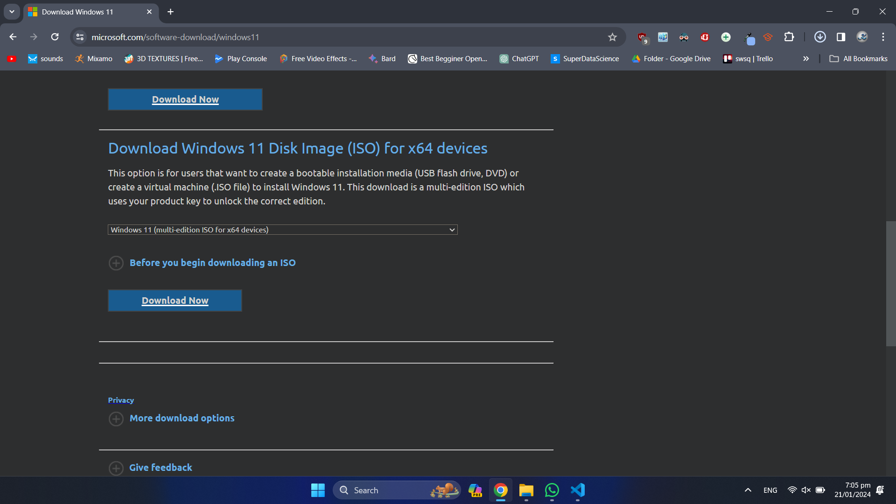

## Creating a bootable USB with Rufus

1. Download and install Rufus from the official website.
2. Insert your USB drive into your computer.
3. Open Rufus and select your USB drive.
4. Click on the 'Select' button and navigate to your downloaded Windows ISO file.

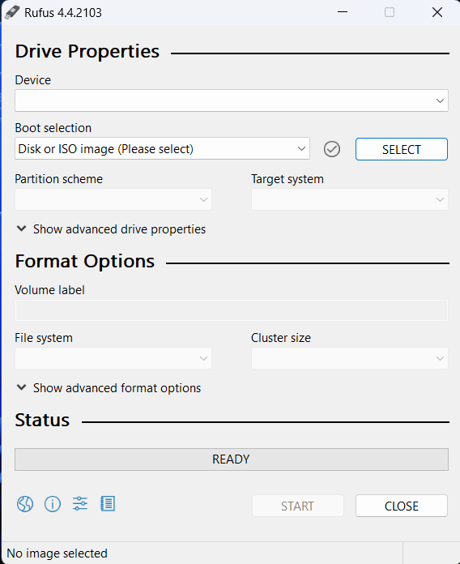

5. For 'Partition Scheme', Select GPT
6. For 'Target System', select UEFI
7. Click on 'Start' to create the bootable USB.

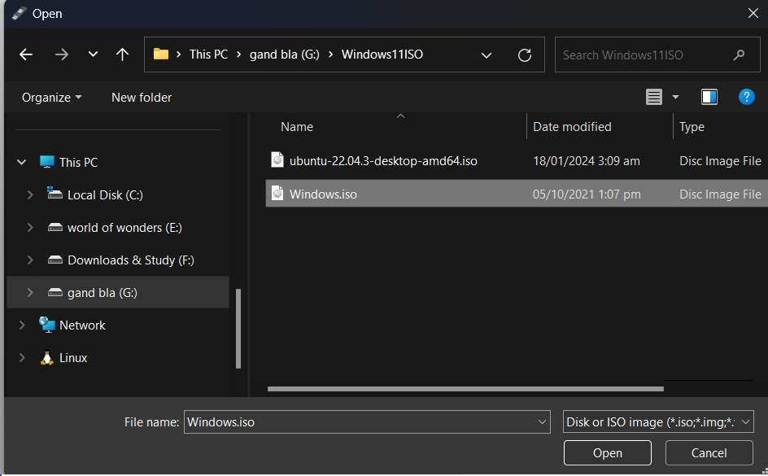

## Booting from USB

1. Restart your computer.
2. Press the boot menu key (usually F12, but it can vary depending on your computer's manufacturer).
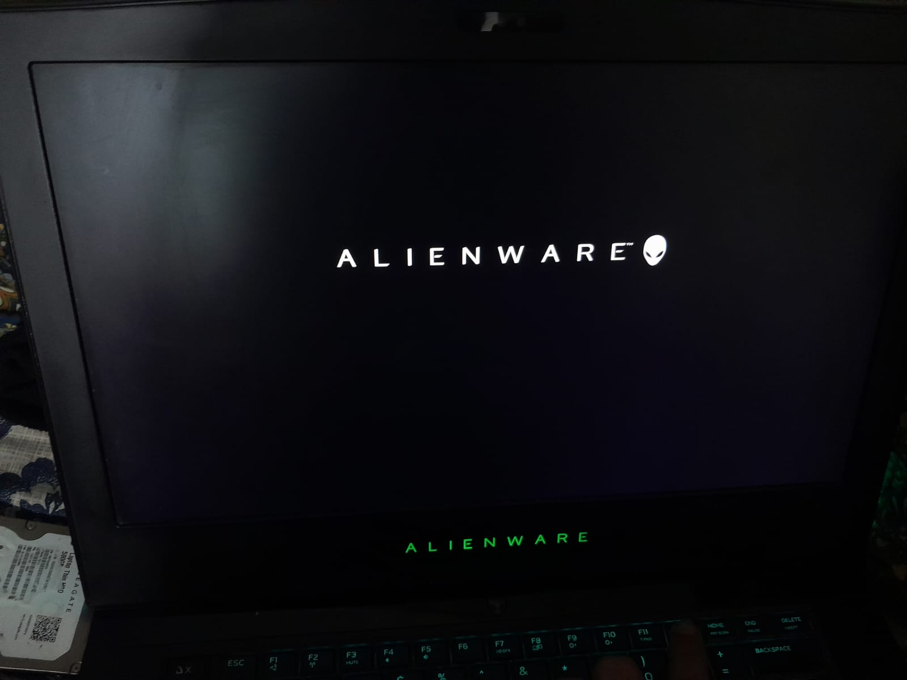
3. Select your USB drive from the boot menu.
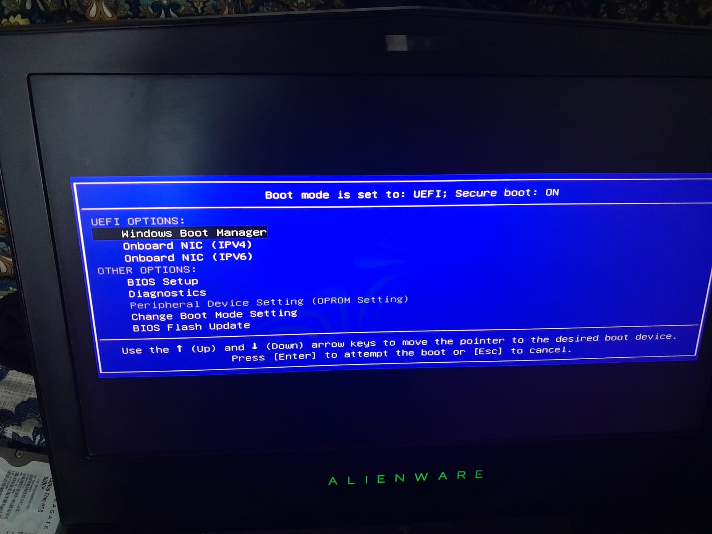

## Completing the setup

1. Follow the on-screen instructions to install Windows.
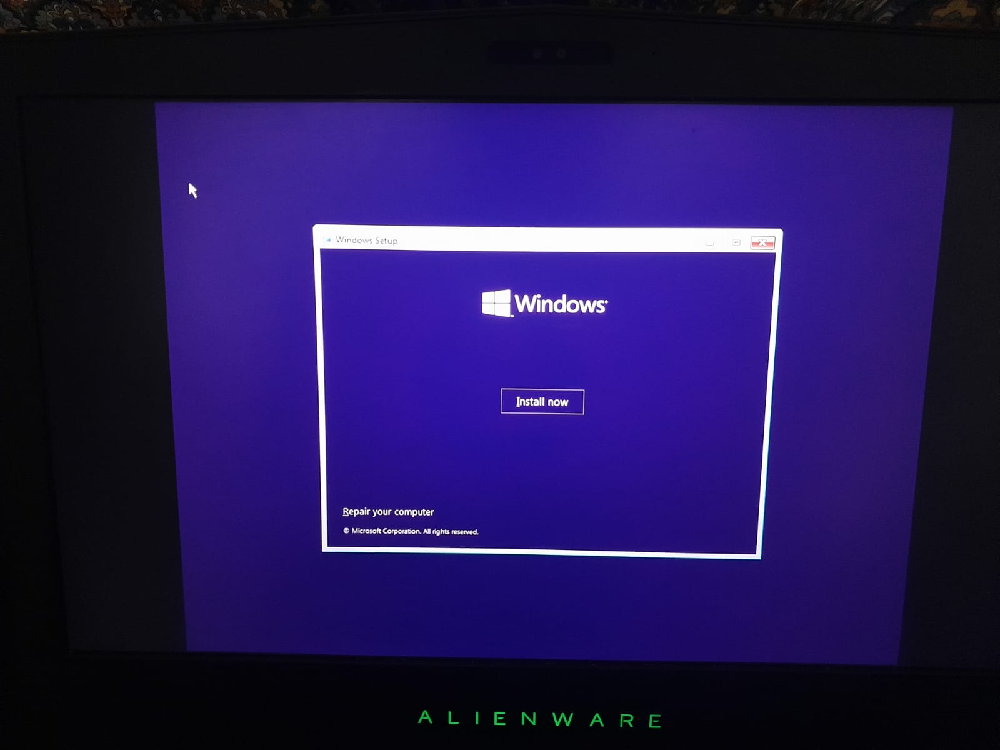
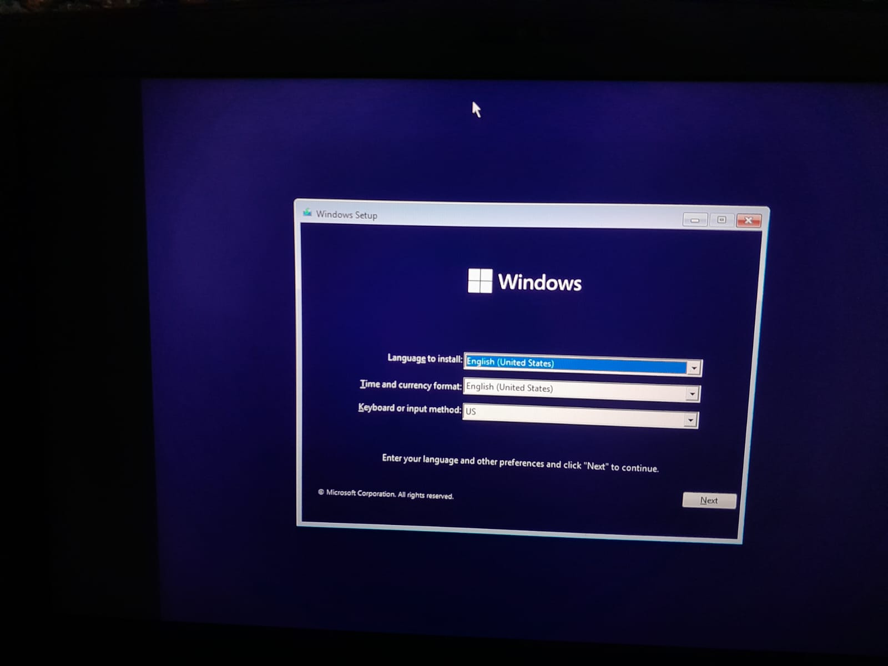
2. When asked, enter your product key/ Or skip this step for now.
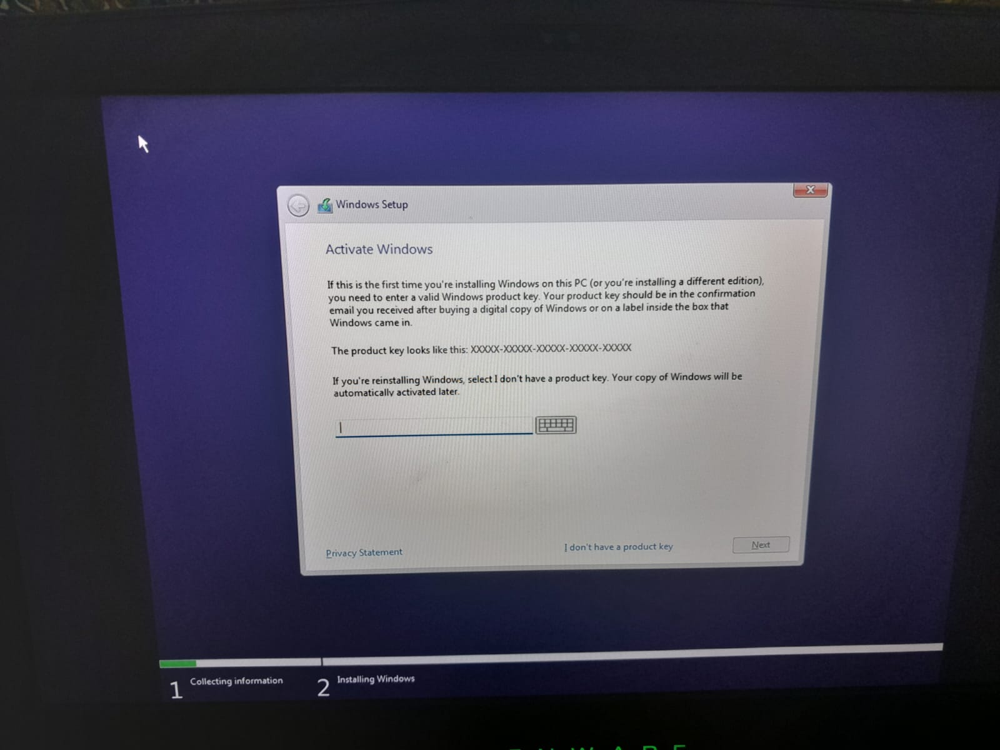
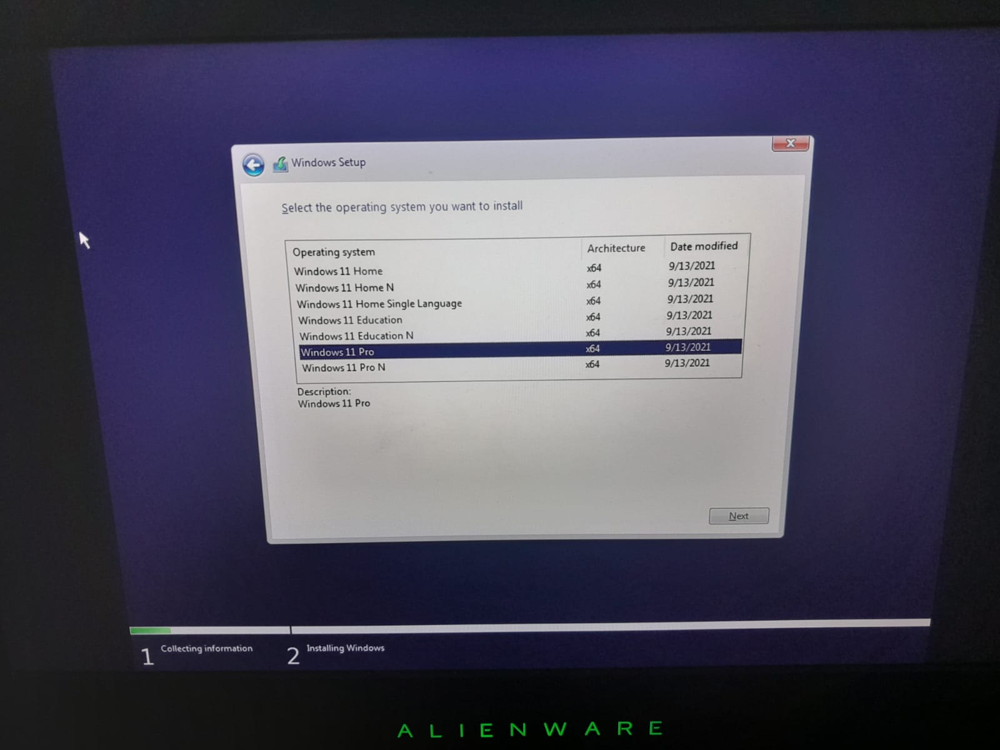
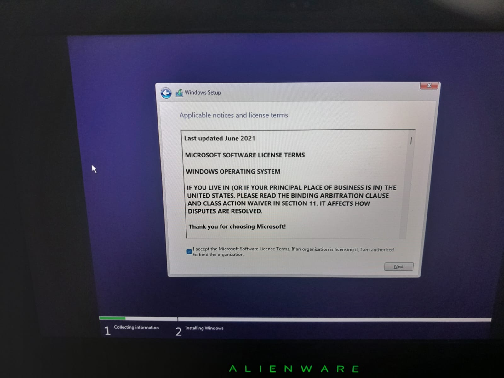
3. Select the type of installation you want (In this case 'Custom: Install Windows only').
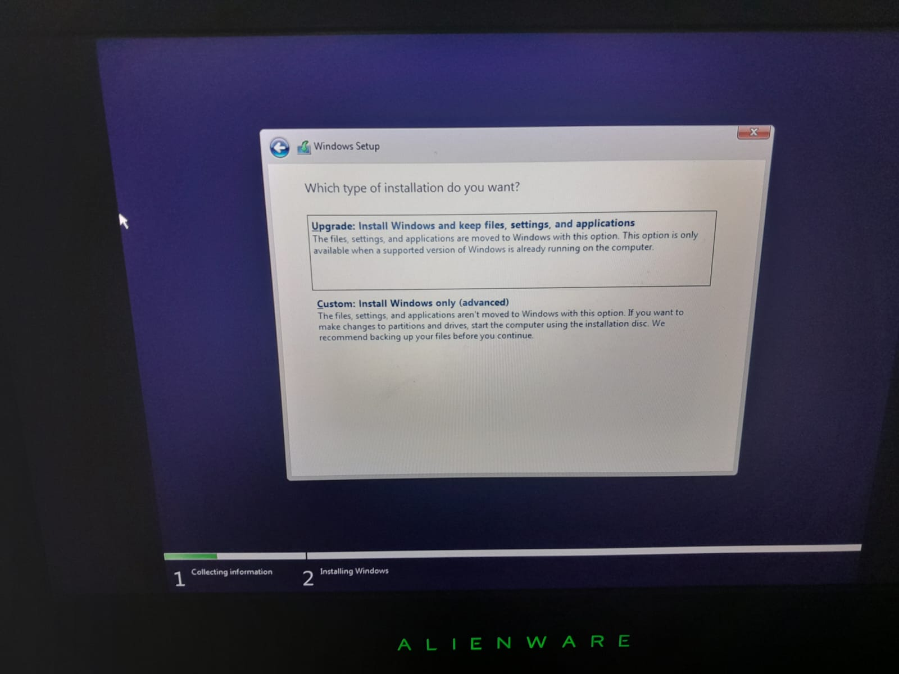
4. Select the drive where you want to install Windows.
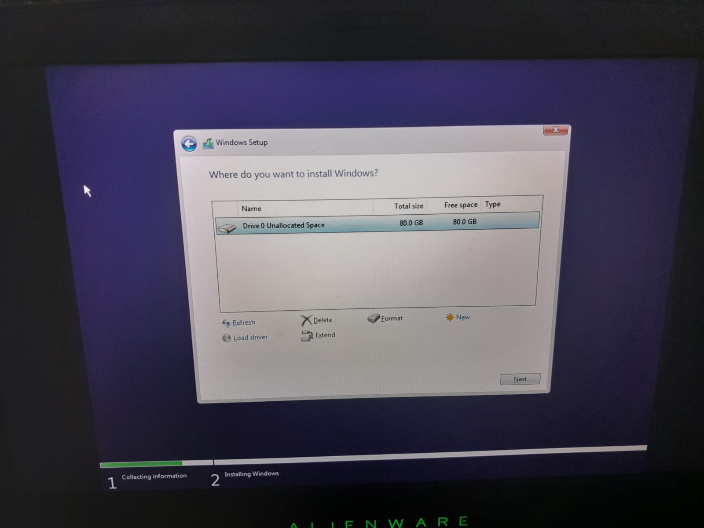
5. Click on 'Next' and wait for the installation to complete.
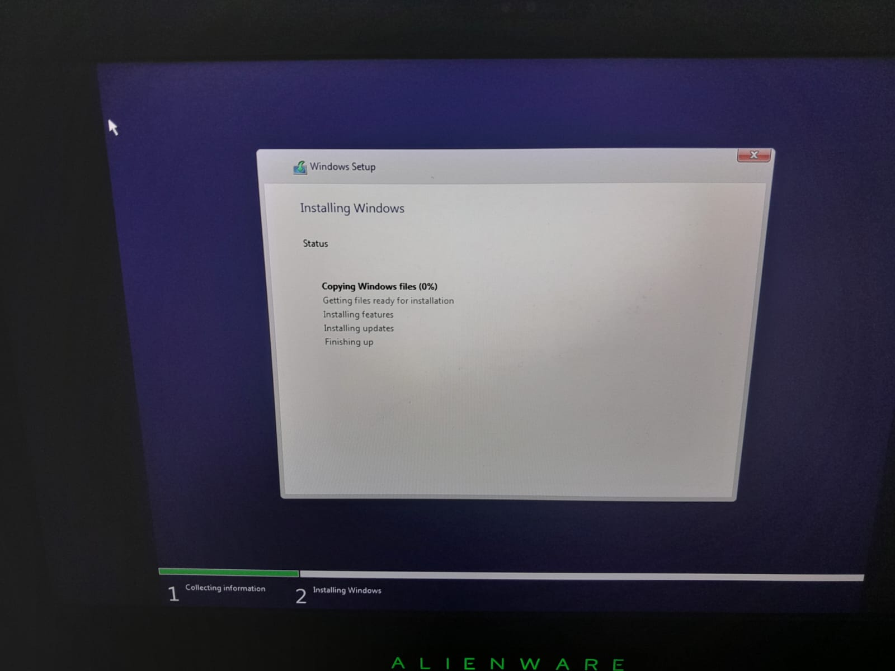

Congratulations, you have successfully installed Windows on your computer!
