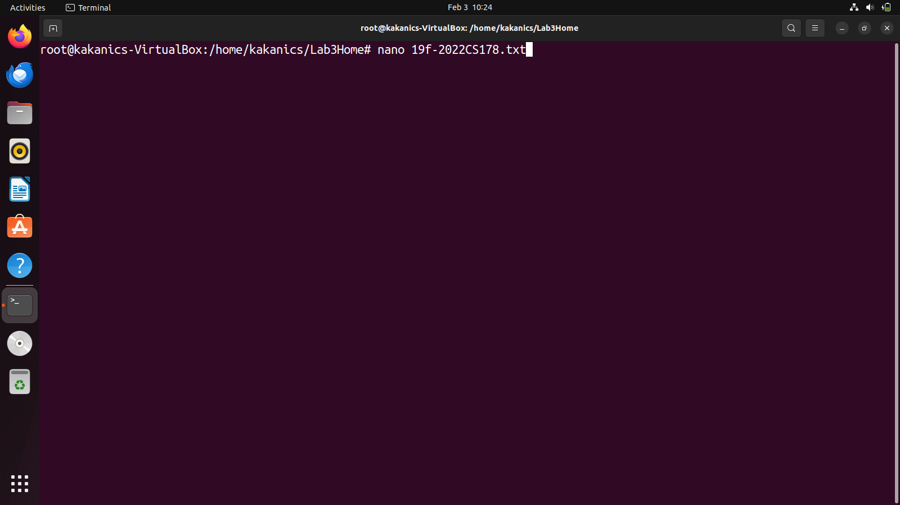
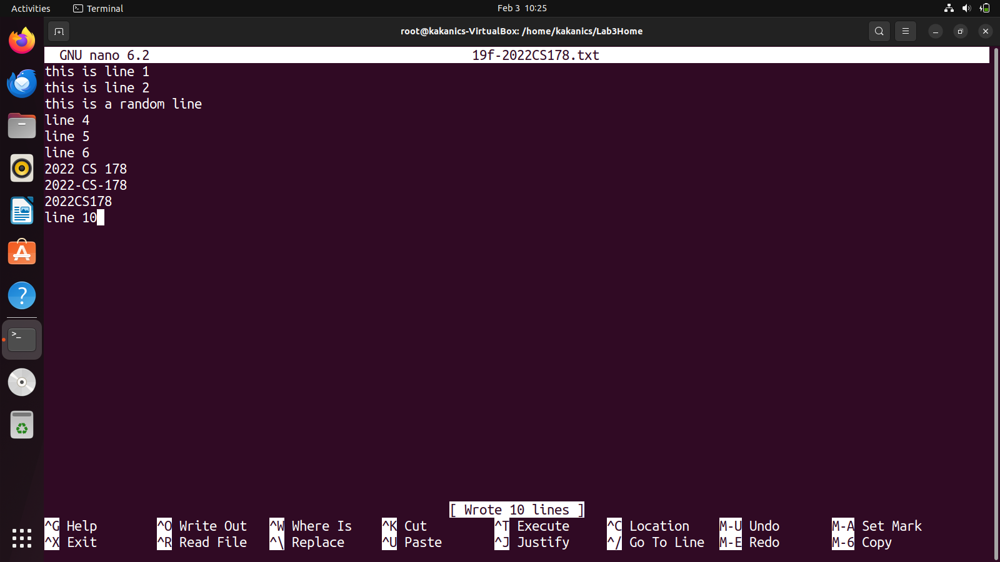
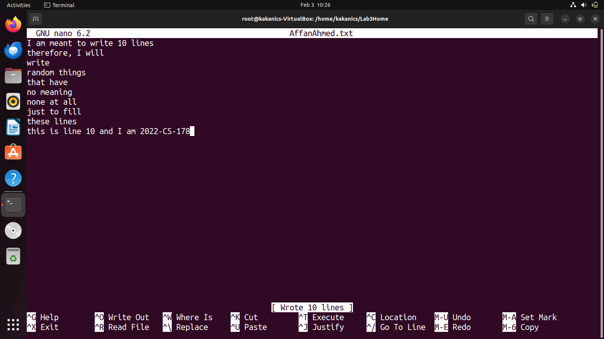
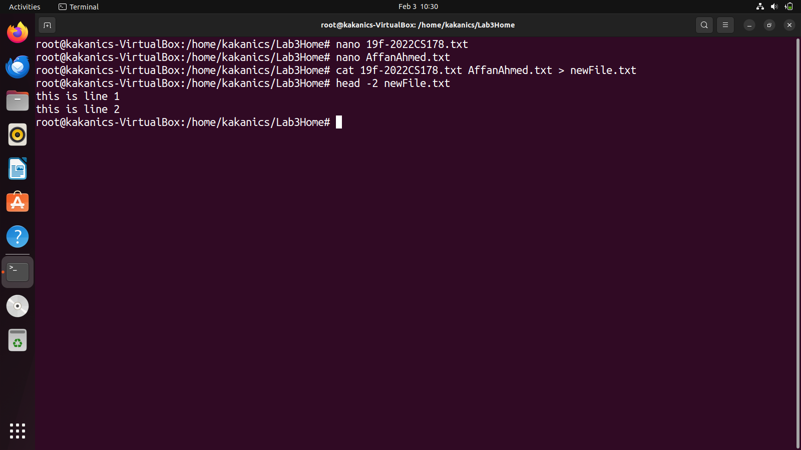
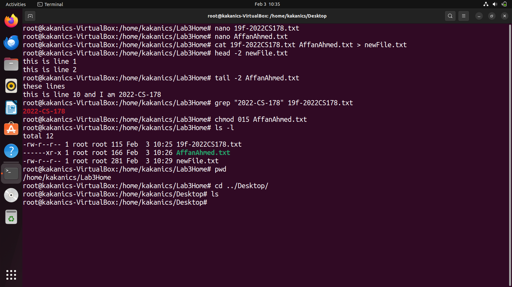
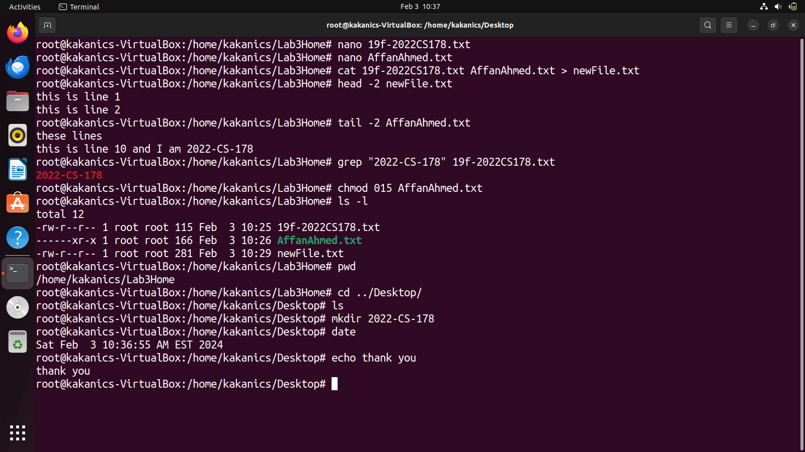
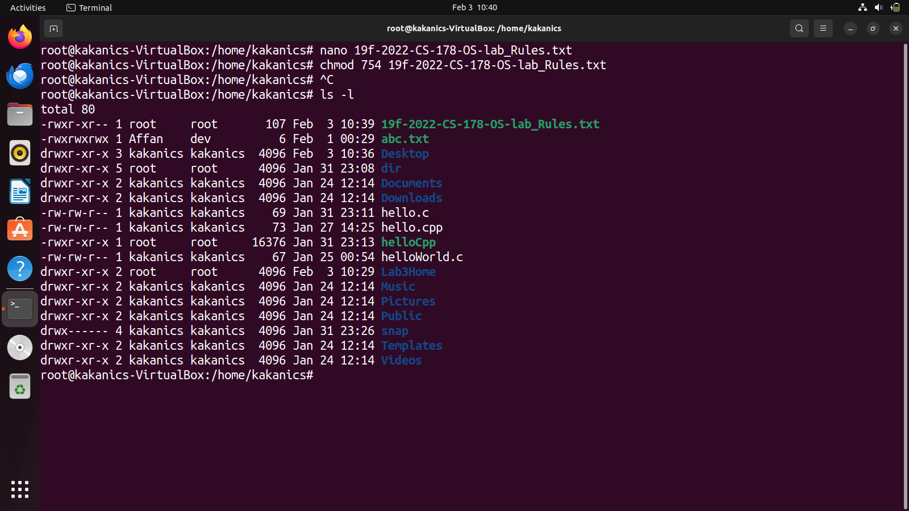
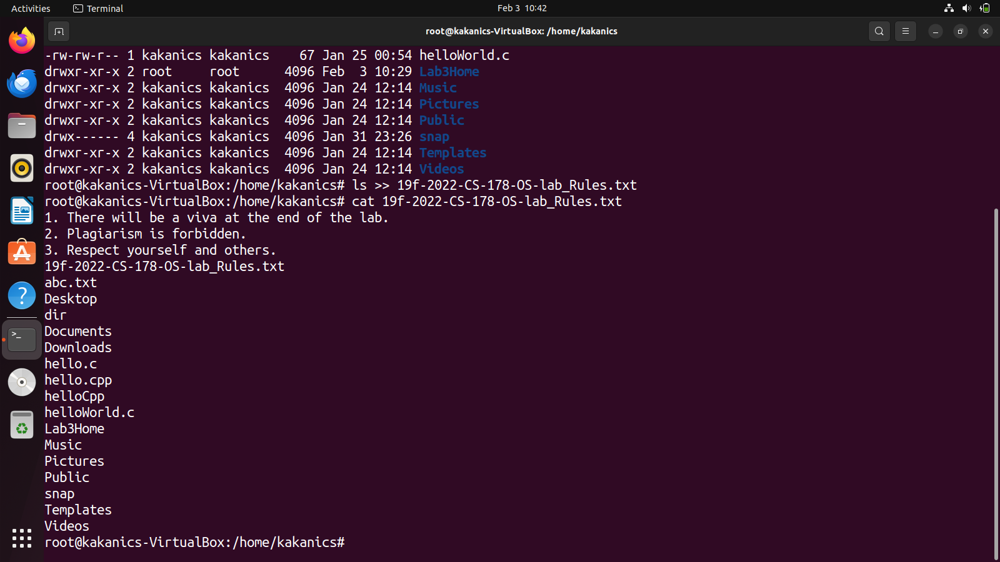

# Lab 3 - Home tasks

## Task 1

### 1. Create a file named “19f-XXXX.txt”. File must contain at least 10 lines

A file can be created using touch command or using nano. Nano is usually used to open files but if a file doesn't exists then it automatically creates it. Same for gedit, between nano and gedit, I prefer nano, after creating the file, it is opened and 10 lines are written.
This can be done using:

`nano 19f-2022CS178.txt`

### 2. Create another file named “your name.txt”. File must contain at least 10 lines

This task is done in same way as top

`nano AffanAhmed.txt`

### 3. Merge the data of both files

cat command is using for this purpose:

`cat 19f-2022CS178.txt AffanAhmed.txt`

### 4. Redirect the output to a new file

cat command with the '>' operator is used. This overwrites all the data in file. For appending, check task 2-4

`cat 19f-2022CS178.txt AffanAhmed.txt > newFile.txt`

### 5. Display the first two lines of first file

head prints the first n lines, it has syntax:

`head -n filename`

for this task:

`head -2 19f-2022CS178.txt`

### 6. Display the last two lines of second file

tail prints the last n lines, it has syntax:

`tail -n filename`

for this task:

`tail -2 19f-2022CS178.txt`

### 7. Finds the string (your roll#) from the first file

grep finds the string

`grep [stringToFind] fileName`

for this task:

`grep 2022-CS-178 19f-2022CS178.txt`

### 8. Grant the execute permission of the second file to the group

chmod gives permissions. 7 for rwx, 6 rw, 5 for rx, 4 for r, 3 for wx, 2 for w, 1 for w

`chmod xyz filename`

where x is user, y is group and z is owner, for this task

`chmod 010 AffanAhmed.txt`

### 9. Remove the write permission for the owner

similar as above, the command will be:

`chmod 015 AffanAhmed.txt`

### 10. Now Mr. Tom suddenly lost the track of his current location. Help him find his location

pwd is print working directory.

`pwd`

### 11. He wants the list of all files present on Desktop directory

ls lists all file of current directory, first he has to navigate to desktop directory. for my current location, I can do this by:

`cd ../Desktop/`

then ls is used for displaying all files

`ls`

### 12. Now he wanted to create a folder of his personal files and pictures named as your roll no

mkdir is make directory and creates a file in current directory

`mkdir 2022-CS-178`

### 13. Display the current time

date command shows current date and time

`date`

### 14. He is done with the task and he is happy with your work. He want to display a thankyou message

echo prints a message, he can use

`echo thank you`

## Task 2

### 1. Create a file named “19f-XXXX_OS-lab_rules.txt” using linux commands. The file must contain all lab rules covered in first lab

as in task 1-1, nano is used for this purpose.

`nano 19f-2022-CS-178-OS-lab_Rules.txt`

The rules are written using the nano editor.

### 2. You want to set the rights of created file to this (- rwx r-x r--). For these rights, you are required to convert the given rights in numeric format using binary number system procedure covered in lecture. Show complete working

as in task 1-8, permissions can be given using:
4 means read or r, 2 means write or w and 1 means execute or x
for rwx permissions, 4+2+1=7
for rx permissions, 4+0+1=5
for r permissions, 4+0+0=4

### 3. Now use the derived number to change the permission of a file using chmod command

`chmod 754 19f-2022-CS-178-OS-lab_Rules.txt`

### 4. Append the output of ls command to created file

The '>>' operator is used for appending data to a file

`ls >> 19f-2022-CS-178-OS-lab_Rules.txt`

is used to redirect the output to the required file

