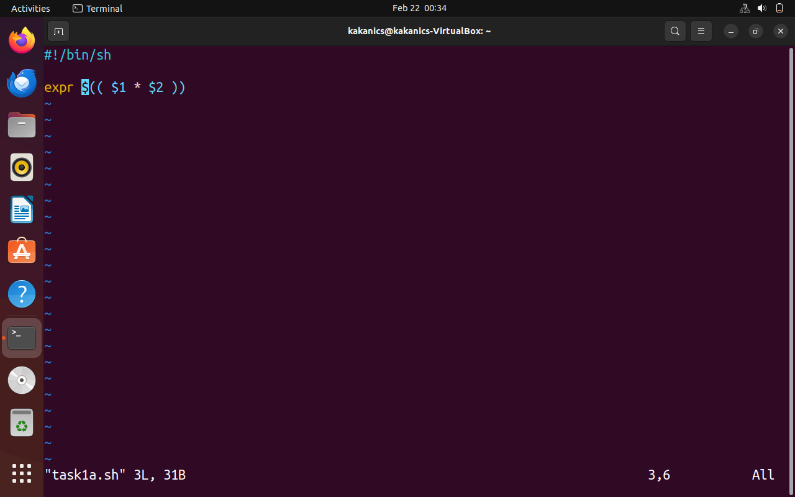
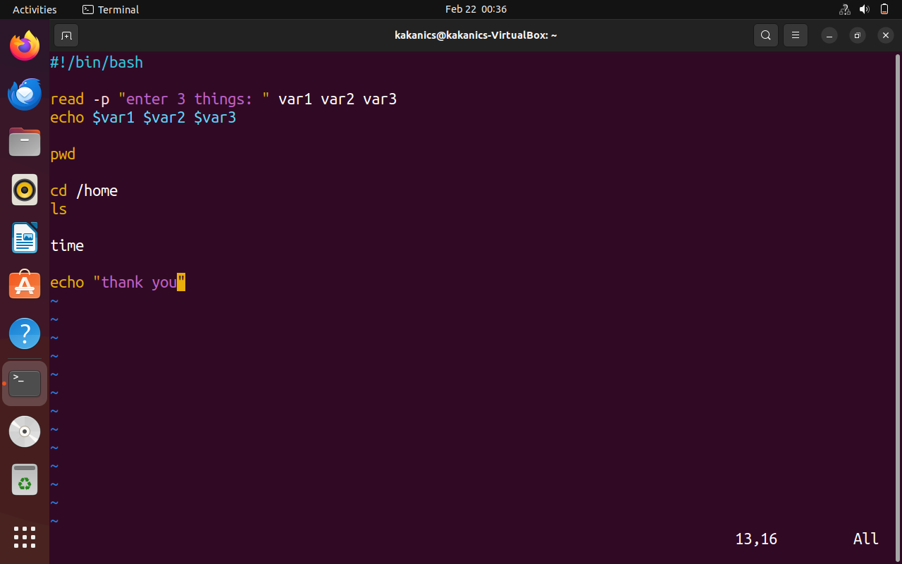
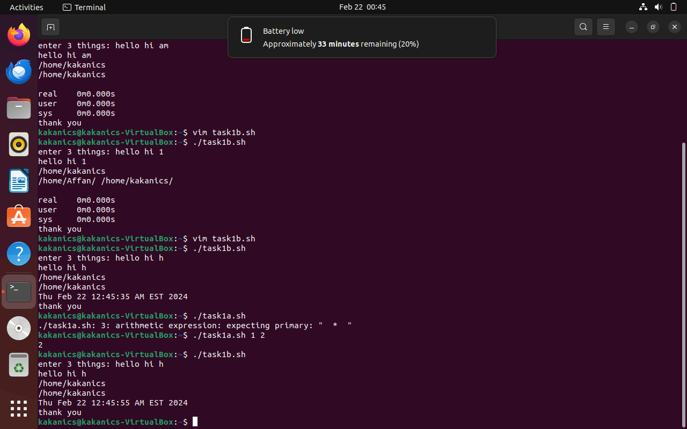
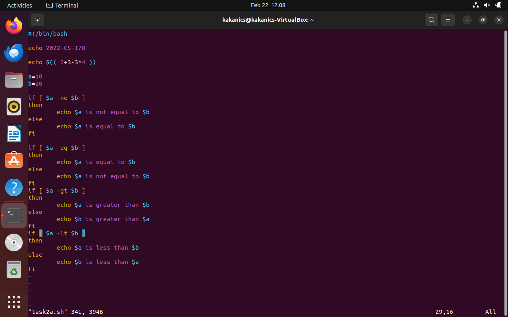
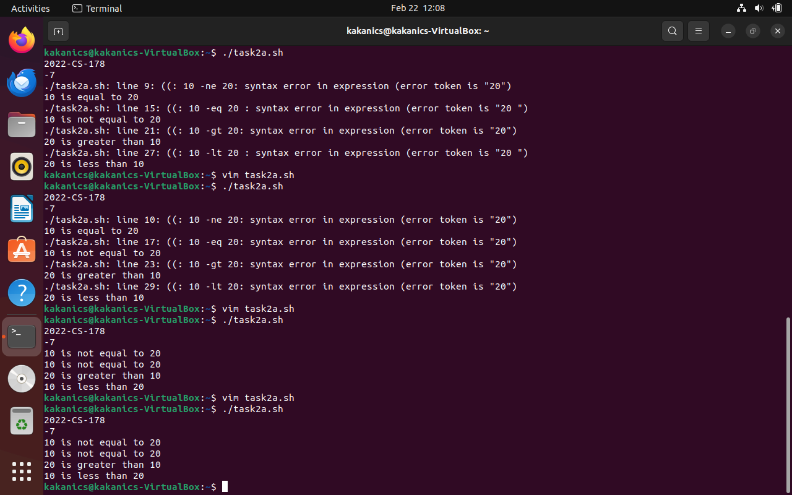

# Lab 3

## Task 1

### 1. Create a simple script which will take two command line arguments and then multiply them together

This is done using '$1' and '$2' identifiers for taking command line arguments

### 2. Second Script

1. This script requires taking multiple inputs from user and echo'ing them on console, `read` and `echo` are the commands for this task
2. Showing the user their current working directoy using `pwd`
3. For files on home directory, the environment variable `$HOME` is used
4. Time is shown using the `date` command
5. The thank you message is shown using `echo`

The execution of all tasks is shown below

## Task 2

### A script is required to show the use of arithmetic and relational operator

Arithmetic operators include `+`, `-`, `*`
Relational operator include `==`, `!=`, `<=`, `>=`, `>`, `<`
These are used using flags,

1. `==` is written using `-eq`
2. `!=` is written using `-ne`
3. `<=` is written using `-ge`
4. `>=` is written using `-le`
5. `<` is written using `-l`
6. `>` is written using `-g`

Image of shell script

Image of running the code

